File Upload Vulnerability in dcat-admin (v1.7.8)

Discoverer: Terry Tian

Credits: Westsec Security Team

1.  Introduction to Vulnerable Project and Affected Version

    Project Overview

    Open-source Project: jqhph/dcat-admin

Project Repository:

<https://github.com/jqhph/dcat-admin>

https://gitee.com/jqhph/dcat-admin

Official Demo/Blog URL: http://www.dcatadmin.com

Project Description: \"A background system building tool based on
Laravel, which can quickly build a fully functional and high-quality
background system with minimal code, equipped with abundant built-in
common components\"

Project Popularity: 4K GitHub Stars, 773 Forks

Affected Version

Version Number: v1.7.8 (Vulnerable stable release)

Release Page: <https://github.com/jqhph/dcat-admin/releases/tag/1.7.8>

The details of affected versions and vulnerable interfaces are as
follows:


http://192.168.1.3/admin/auth/login，The username and password are both
admin.

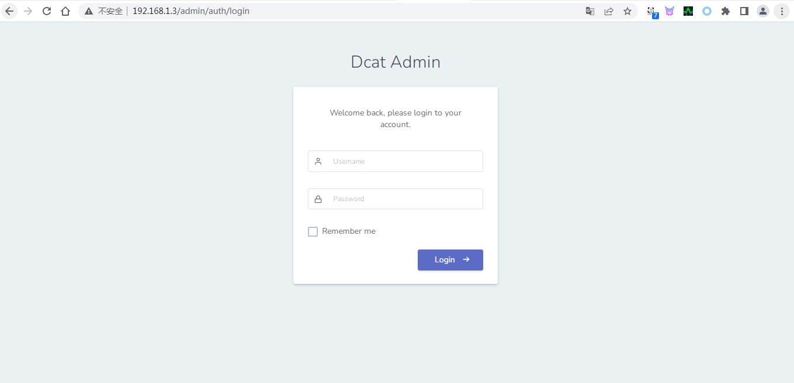

Vulnerable Version: Powered by Dcat Admin·v1.7.8

After logging into the system successfully, you can see the version
number of the vulnerable system at the bottom of the page, as shown in
the figure:


The vulnerable interfaces are listed below:

<http://192.168.1.3/admin/auth/users>

<http://192.168.1.3/admin/auth/setting>

2.Exploit Ideas and Procedures

0x1. The attacker logs in to the Dcat Admin backend and navigates to the
personal center or user management page.

0x2. The system adopts a filename suffix blacklist check. Create a PHP
one-sentence webshell with valid image headers, set the file suffix to
.pht or other risky extensions, and configure the Content-Type as
image/png.

0x3. Upload the malicious file via the avatar upload function which
relies on the UploadField trait. The backend only verifies the MIME type
and fails to filter executable file suffixes, so the file is
successfully saved to the directory:
D:\\phpstudy_pro\\WWW\\dcat-admin\\storage\\app\\public\\images.

0x4. By default, Laravel and Dcat Admin only grant public access to the
public directory. To access files under the storage directory and its
subdirectories in the root path, the operation and maintenance staff or
administrator needs to create a symbolic link.

0x5. The attacker accesses the PHP script file through a webshell
management tool. The Apache web server parses the file as a PHP script,
allowing arbitrary code execution and full takeover of server
privileges.

Rules of the system\'s suffix blacklist check are as follows:

Vulnerable Interface 1: <http://192.168.1.3/admin/auth/users>


Vulnerable Interface 2:<http://192.168.1.3/admin/auth/setting>

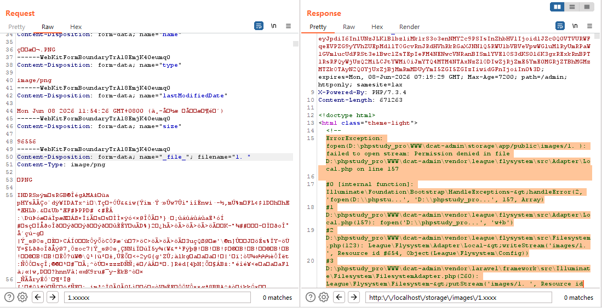


Proof of Concept Procedures are as follows:

Vulnerable Interface 1：<http://192.168.1.3/admin/auth/users>

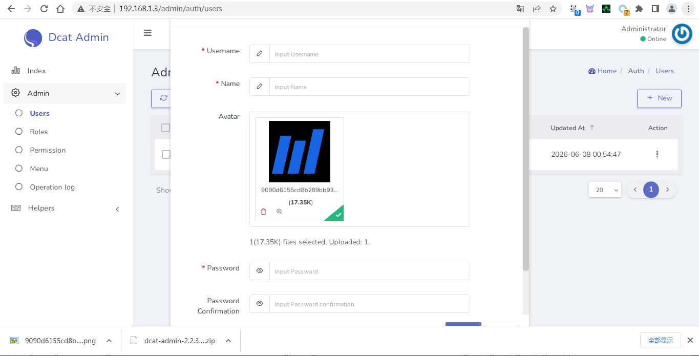

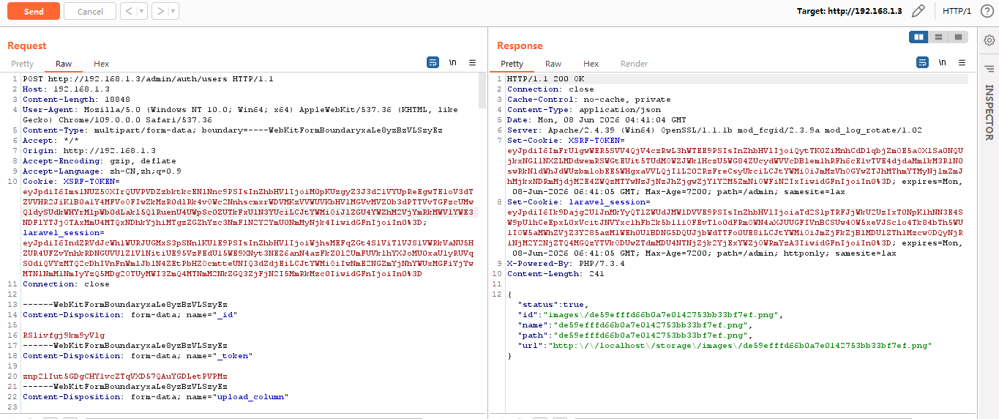

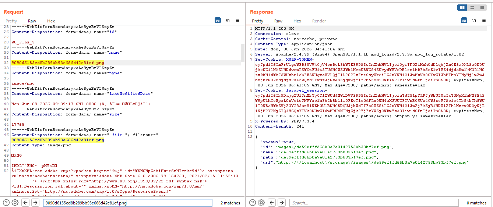

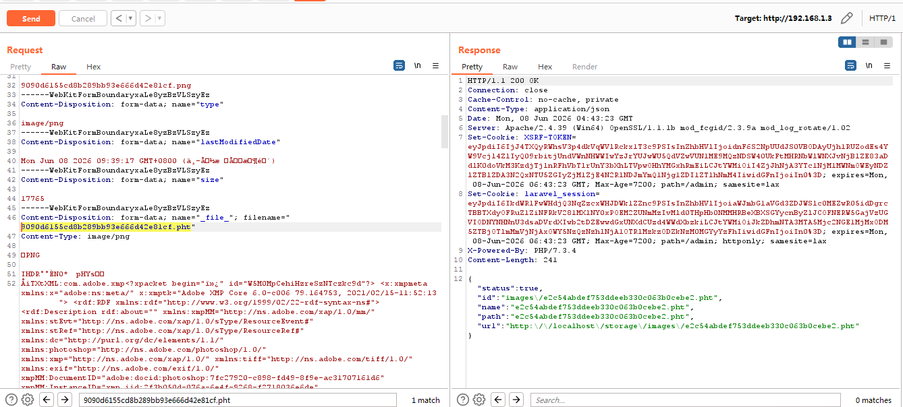

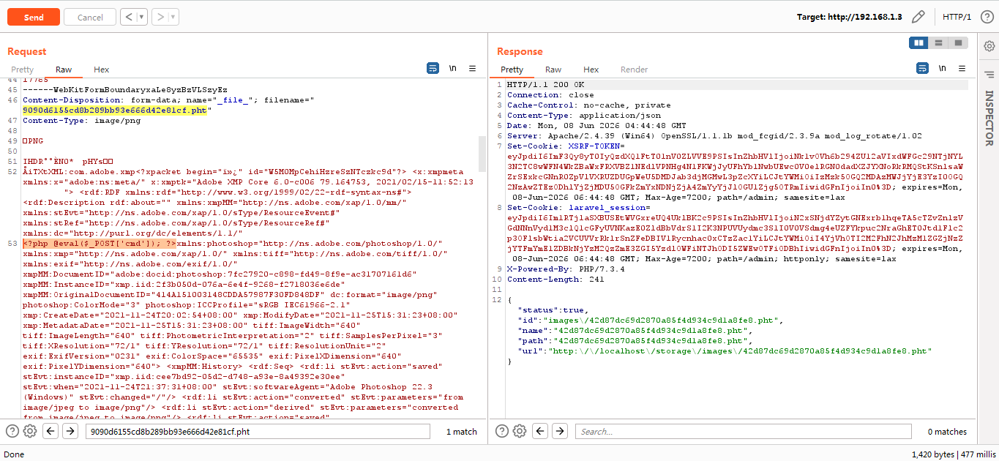

<http://localhost/storage/images/42d87dc69d2870a85f4d934c9d1a8fe8.pht>

Vulnerable Interface 2：<http://192.168.1.3/admin/auth/setting>

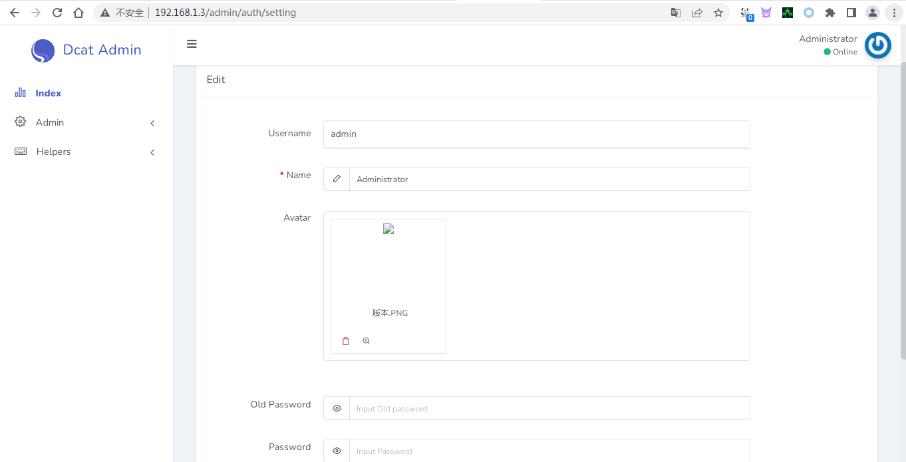

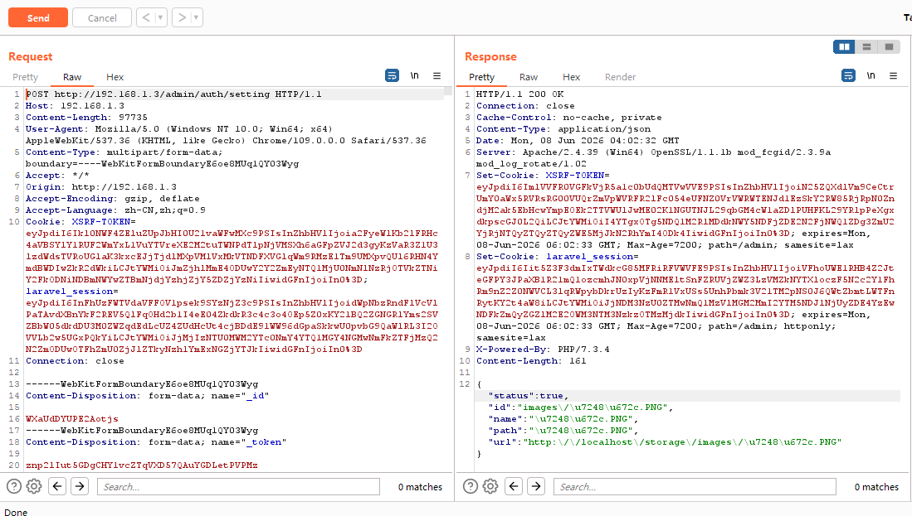

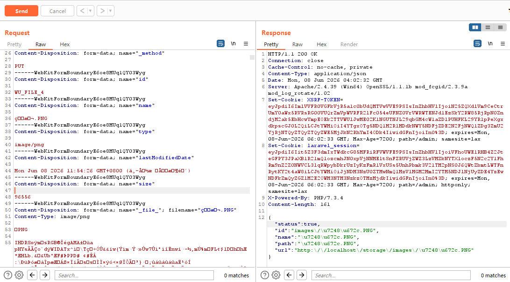

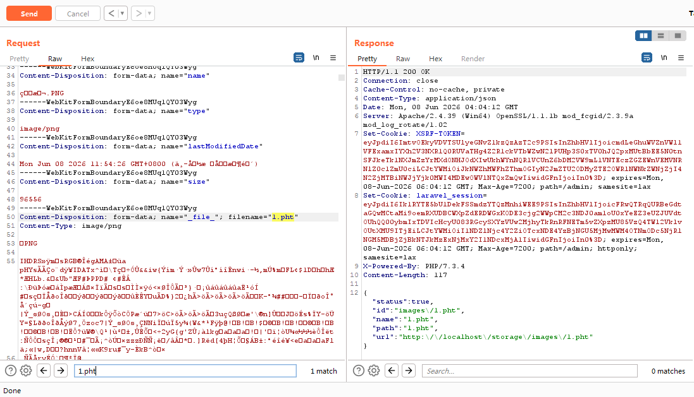

Summary: The following file types can be uploaded (see figure): .pht and
other extensions.

Storage
Directory:D:\\phpstudy_pro\\WWW\\dcat-admin\\storage\\app\\public\\images

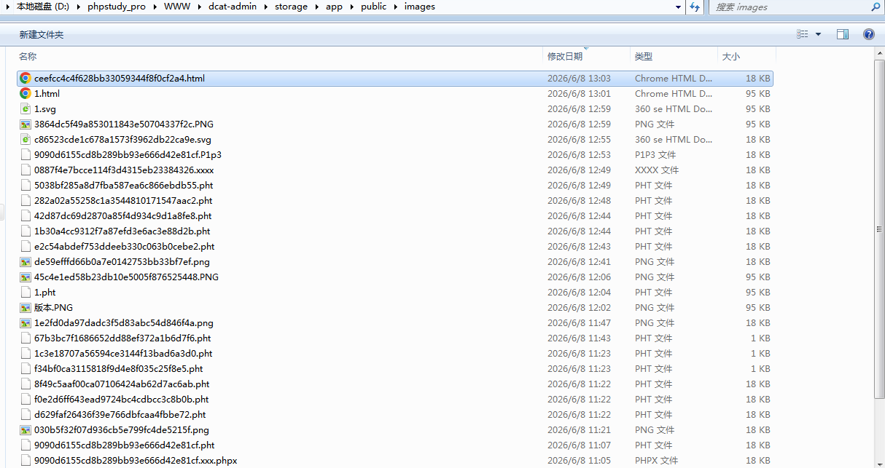


Next, navigate to the project root directory (not the public folder; the
path is D:\\phpstudy_pro\\WWW\\dcat-admin). Run the command php artisan
storage:link to create a symbolic link named public/storage. After that,
the uploaded files can be accessed directly via a web browser. This
configuration is adopted by nearly all websites for business
requirements, as shown in the figure.

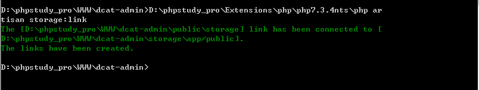

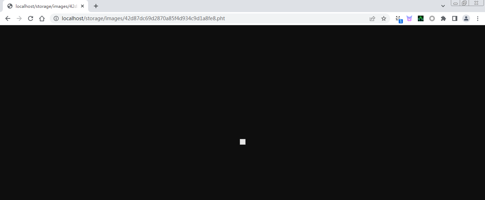

Next, use a webshell management tool to access the PHP script file. The
Apache server parses the file as a PHP script, enabling arbitrary code
execution and gaining full server privileges, as shown in the figure.

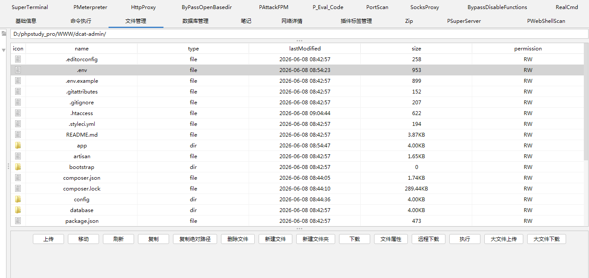

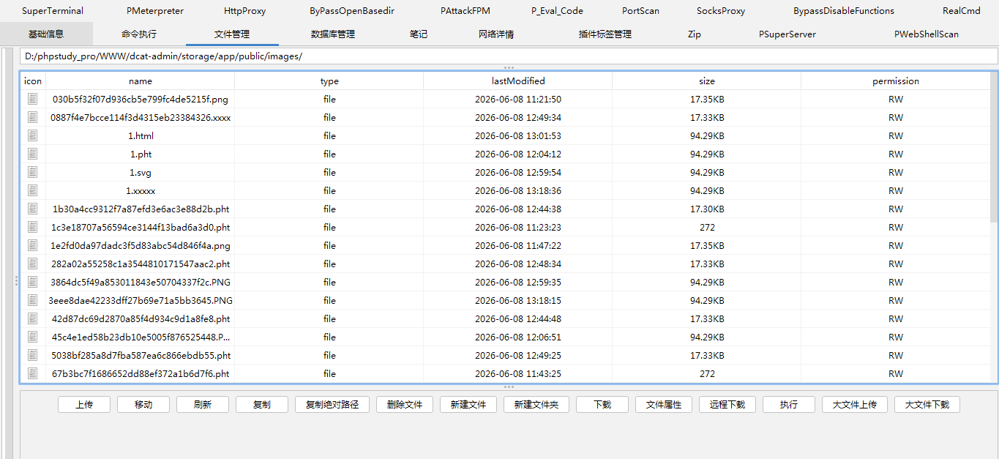

The .pht extension is an executable file type natively supported by
Apache and PHP, yet its risks are often overlooked. If a website only
blocks uploads of .php files while allowing .pht files, and the Apache
configuration contains rules such as AddHandler, AddType or FilesMatch
for .pht, attackers can upload .pht files embedded with PHP webshells to
publicly accessible directories like /uploads and /storage/images.
Simply accessing these files will trigger arbitrary PHP code execution,
resulting in remote command execution and ultimately server takeover
(getshell).

3.  Code Audit Analysis

    Next, we analyze the root cause of the vulnerability through source
    code. In fact, the file upload vulnerability originates from the
    UploadField.php trait. Below is the complete code-level analysis.

    The UploadField trait is the core implementation for all file upload
    fields in Dcat Admin (including avatars and attachments). Its
    validation logic contains critical flaws that lead to the arbitrary
    file upload vulnerability.

```{=html}
<!-- -->
```
1.  Lack of Core Validation: File Suffix/Type Blacklist Only Defined
    Frontend, No Unified Backend Filtering

    \$this-\>getRules() retrieves validation rules defined by specific
    field classes (e.g., Image/File), not unified validation within the
    UploadField trait.

    For image fields like avatars, rules are typically image or
    mimes:jpeg,png, which rely on Laravel\'s Validator.

    This only verifies the file MIME type, not the actual file content
    or suffix.

    Attackers can upload files with a forged image/png MIME type and a
    .pht suffix to bypass image validation directly.

    The UploadField itself has no blacklist filtering for executable
    suffixes such as .pht, nor any global suffix validation logic.

2.  Filename Generation Directly Uses Client-Submitted Suffix Without
    Rewriting

    \$file-\>getClientOriginalExtension() directly fetches the
    client-submitted file extension.

    The backend does not rewrite the suffix with a whitelist (e.g.,
    force it to .png).

    This allows attackers to retain executable suffixes like .pht.

    For example: even if uploading shell.png.pht, the backend preserves
    the full suffix and writes the file without any secure modification.

3.  Upload Storage Logic Has No Filtering, Writes Directly to Publicly
    Accessible Directory

    putFileAs writes the file directly to the directory returned by
    \$this-\>getDirectory() without any secondary content inspection.

    The directory path is defined by the field class; avatar files are
    written to storage/app/public/images by default.

    This directory becomes publicly accessible via the web after
    creating a symbolic link with php artisan storage:link.

    Uploaded PHP script files are parsed and executed by Apache,
    directly triggering remote code execution.

4.  No File Content Validation, Supports Image Header + PHP Mixed Files

    UploadField only relies on Laravel\'s validator image rule, which
    only checks the MIME type and basic image structure, not deep
    content parsing.

    Attackers can upload mixed files with a valid PNG image header + PHP
    code (e.g., PNG + \<?php \@eval(\$\_POST\[\'cmd\'\]);?\>).

    The backend recognizes it as a valid image and writes it to the
    server.

    Apache parses the file by its suffix and executes the PHP code,
    bypassing all validation.

    D:\\phpstudy_pro\\WWW\\dcat-admin\\vendor\\dcat\\laravel-admin\\src\\Traits\\HasUploadedFile.php

    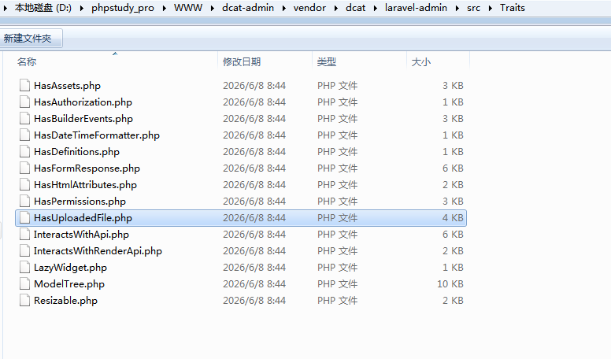

    D:\\phpstudy_pro\\WWW\\dcat-admin\\vendor\\dcat\\laravel-admin\\src\\Form\\Field\\UploadField.php

    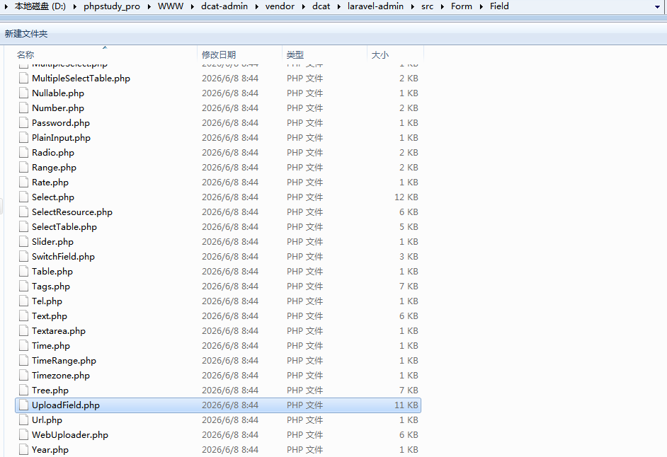

    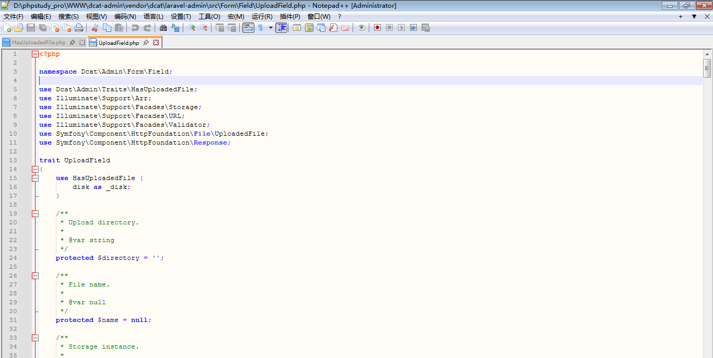

    

    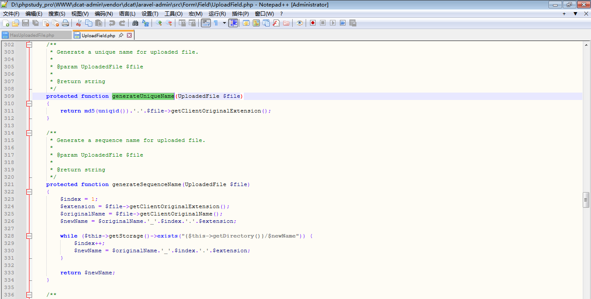

    