Dcat-admin System Arbitrary File Upload Vulnerability Leading to Remote Code Execution(RCE)

Discoverer: Terry Tian

Credits: WestSec Security Team

1.  Introduction to Vulnerable Project and Affected Version

    Project Overview

    Open-source Project: jqhph/dcat-admin

    Project Repository: https://github.com/jqhph/dcat-admin

    Official Demo/Blog URL: http://www.dcatadmin.com

    Project Description: \"A Laravel-based backend development toolkit
    (Laravel Admin). It helps you quickly build a fully-featured,
    elegant backend system with minimal code. Packed with a wealth of
    commonly used backend components ready for out-of-the-box use, it
    frees developers from cumbersome HTML coding\"

    Project Popularity: 4K GitHub Stars

    Affected Version

    Version Number:

    All versions

    v1.7.8(Latest stable release)

    v2.2.2(beta)

    v2.2.3(beta)

    \...

    Release Page: https://github.com/jqhph/dcat-admin/releases

2.  Tested Affected Systems

Vulnerable Environment: Powered by Dcat Admin v1.7.8

Vulnerable Environment: Powered by Dcat Admin v2.2.2-beta

Default System Features Showcase：

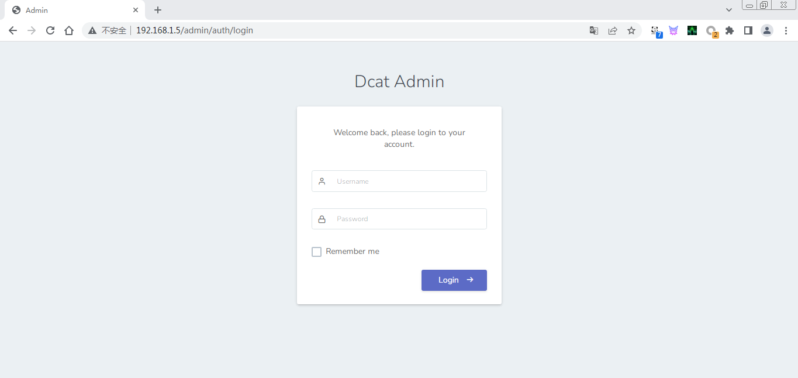

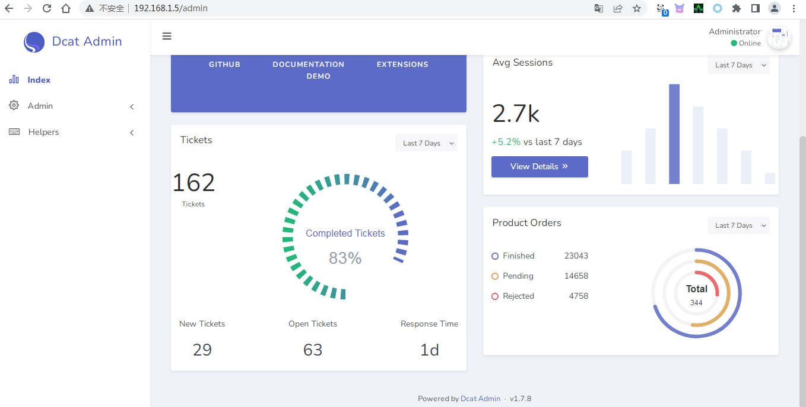

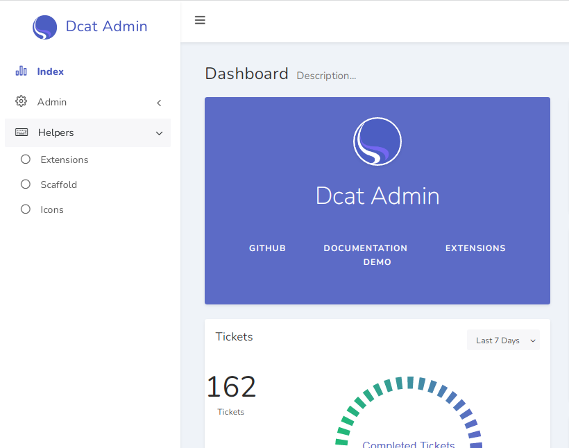

Vulnerable Interface Showcase：http://192.168.1.5/admin/dcat-api/form/upload

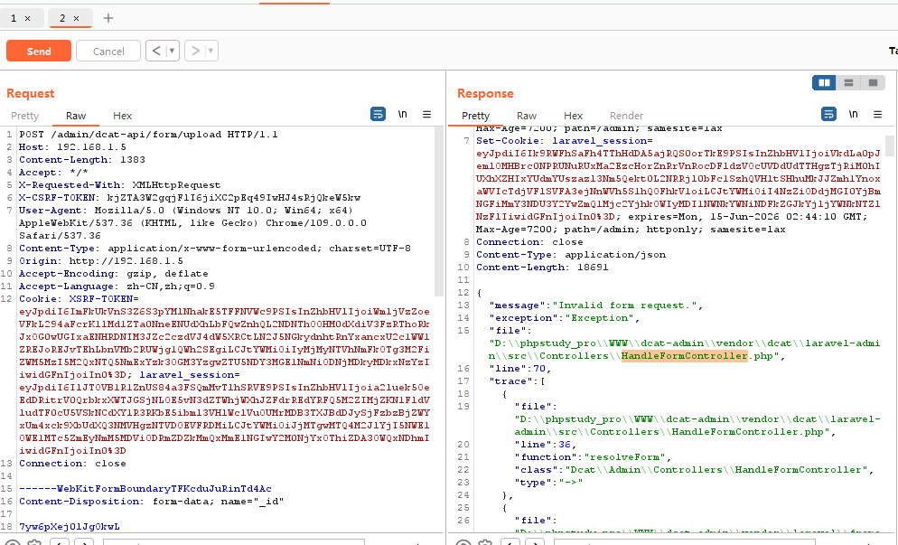

Errors occurred during testing in the locally deployed environment.
Although the framework was installed correctly, the menu entry for
exploiting the vulnerable interface could not be found in the backend
admin panel.

Possible reasons: The vulnerable interface exists in the source code,
but a corresponding menu needs to be manually configured by developers
to access it via the backend menu. There may also be other contributing
factors. We will proceed with the demonstration using another
environment instead.

Vulnerable Environment: Powered by Dcat Admin v1.7.8

Vulnerable Environment: Powered by Dcat Admin v2.2.2-beta

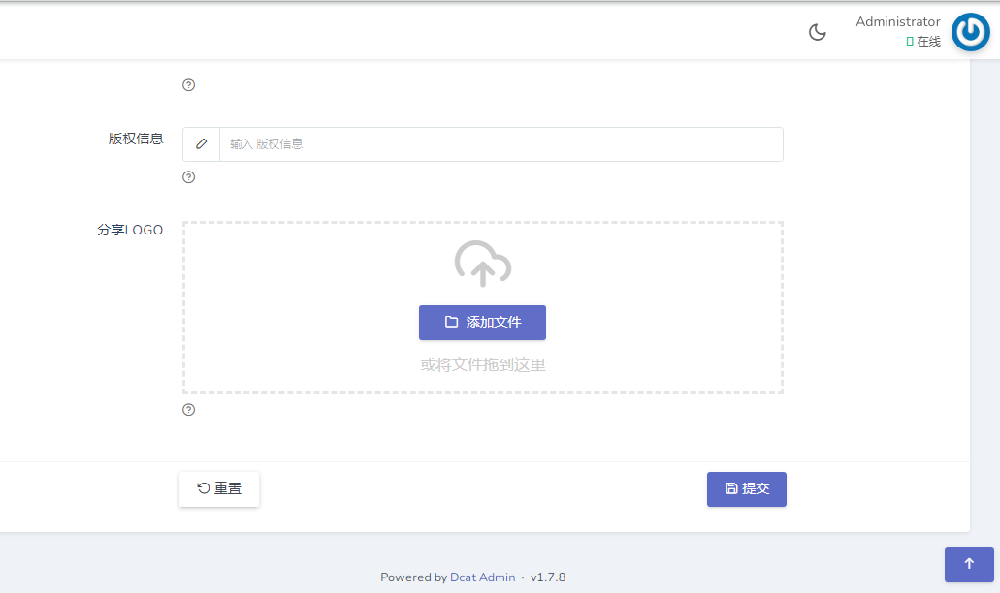

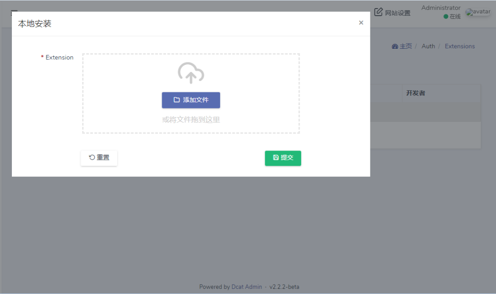

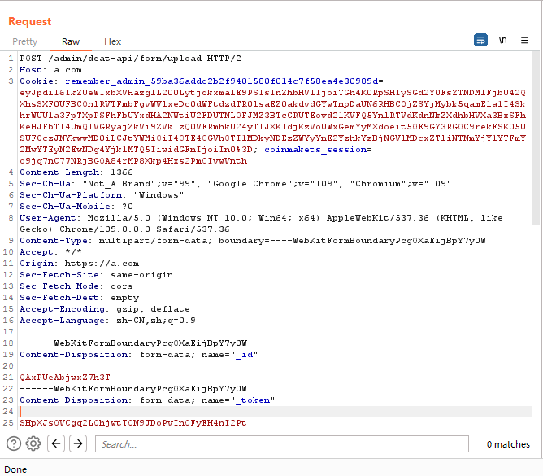

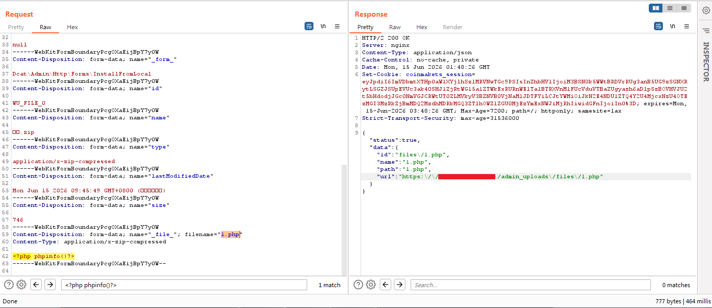

Browser Access: https://a.com/admin_uploads/files/1.php

Remote PHP code execution succeeded. See screenshot below:

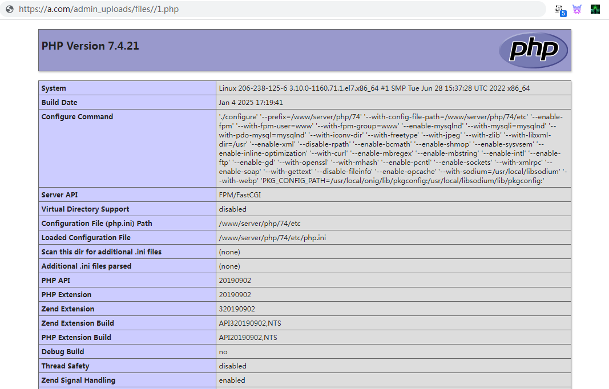

By uploading a one-sentence webshell, we can gain server privileges and
getshell. See the screenshot below:

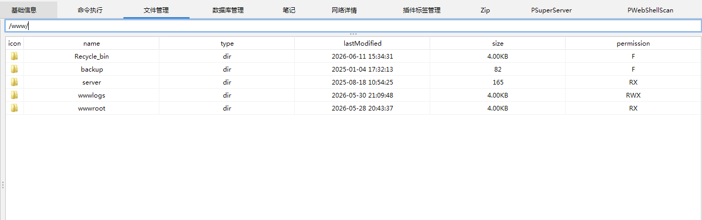

3.  Source Code Audit

Next, let\'s analyze: HandleFormController.php

D:\\phpstudy_pro\\WWW\\dcat-admin\\vendor\\dcat\\laravel-admin\\src\\Controllers\\HandleFormController.php

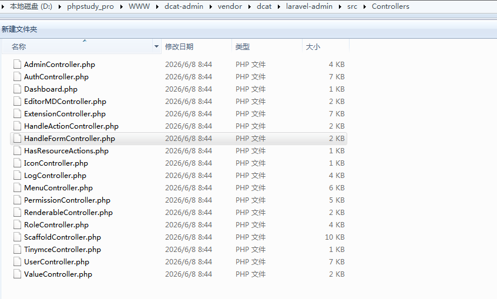

\<?php

namespace Dcat\\Admin\\Controllers;

use Dcat\\Admin\\Form\\Field\\File;

use Dcat\\Admin\\Traits\\HasUploadedFile;

use Dcat\\Admin\\Widgets\\Form;

use Exception;

use Illuminate\\Http\\Request;

class HandleFormController

{

use HasUploadedFile;

public function handle(Request \$request)

{

\$form = \$this-\>resolveForm(\$request);

if (! \$form-\>passesAuthorization()) {

return \$form-\>failedAuthorization();

}

\$form-\>form();

if (\$errors = \$form-\>validate(\$request)) {

return \$form-\>validationErrorsResponse(\$errors);

}

\$input = \$form-\>sanitize(\$request-\>all());

return \$form-\>handle(\$input) ?: \$form-\>success();

}

public function uploadFile(Request \$request)

{

\$form = \$this-\>resolveForm(\$request);

\$form-\>form();

/\* \@var \$field File \*/

\$field = \$form-\>field(\$this-\>uploader()-\>upload_column);

return \$field-\>upload(\$this-\>file());

}

public function destroyFile(Request \$request)

{

\$form = \$this-\>resolveForm(\$request);

\$form-\>form();

/\* \@var \$field File \*/

\$field = \$form-\>field(\$request-\>\_column);

\$field-\>deleteFile(\$request-\>key);

return \$this-\>responseDeleted();

}

/\*\*

\* \@param Request \$request

\*

\* \@throws Exception

\*

\* \@return Form

\*/

protected function resolveForm(Request \$request)

{

if (! \$request-\>has(Form::REQUEST_NAME)) {

throw new Exception(\'Invalid form request.\');

}

\$formClass = \$request-\>get(Form::REQUEST_NAME);

if (! class_exists(\$formClass)) {

throw new Exception(\"Form \[{\$formClass}\] does not exist.\");

}

/\*\* \@var Form \$form \*/

\$form = app(\$formClass);

if (! method_exists(\$form, \'handle\')) {

throw new Exception(\"Form method {\$formClass}::handle() does not
exist.\");

}

return \$form;

}

}

HandleFormController.php itself contains no vulnerabilities; it merely
acts as the entry controller for file upload requests.The actual upload
vulnerability lies in the upload validation logic within the field class
File.php.Dcat-Admin is a PHP backend framework. File upload
functionality is a high-risk attack surface. We focus the audit on the
File::upload() method.Exploitation core: Bypass file extension
validation + Upload directory accessible via web + Web container parses
script files.Next, we continue the analysis of File.php.

D:\\phpstudy_pro\\WWW\\dcat-admin\\vendor\\dcat\\laravel-admin\\src\\Form\\Field\\File.php

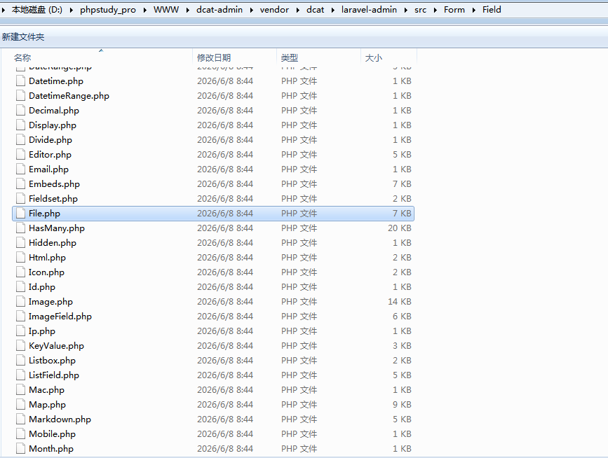

\<?php

namespace Dcat\\Admin\\Form\\Field;

use Dcat\\Admin\\Contracts\\UploadField as UploadFieldInterface;

use Dcat\\Admin\\Form\\Field;

use Dcat\\Admin\\Form\\NestedForm;

use Dcat\\Admin\\Support\\Helper;

use Dcat\\Admin\\Support\\JavaScript;

use Illuminate\\Support\\Arr;

use Illuminate\\Support\\Facades\\Validator;

use Illuminate\\Support\\Str;

class File extends Field implements UploadFieldInterface

{

use WebUploader, UploadField;

protected static \$css = \[

\'\@webuploader\',

\];

protected static \$js = \[

\'\@webuploader\',

\];

protected \$containerId;

/\*\*

\* \@param string \$column

\* \@param array \$arguments

\*/

public function \_\_construct(\$column, \$arguments = \[\])

{

parent::\_\_construct(\$column, \$arguments);

\$this-\>setupDefaultOptions();

\$this-\>containerId = \$this-\>generateId();

}

public function setElementName(\$name)

{

\$this-\>mergeOptions(\[\'elementName\' =\> \$name\]);

return parent::setElementName(\$name);

}

/\*\*

\* \@return mixed

\*/

public function defaultDirectory()

{

return config(\'admin.upload.directory.file\');

}

/\*\*

\* {\@inheritdoc}

\*/

public function getValidator(array \$input)

{

if (request()-\>has(static::FILE_DELETE_FLAG)) {

return false;

}

if (\$this-\>validator) {

return \$this-\>validator-\>call(\$this, \$input);

}

if (! Arr::has(\$input, \$this-\>column)) {

return false;

}

\$value = Arr::get(\$input, \$this-\>column);

\$value = array_filter(is_array(\$value) ? \$value : explode(\',\',
\$value));

\$fileLimit = \$this-\>options\[\'fileNumLimit\'\] ?? 1;

if (\$fileLimit \< count(\$value)) {

\$this-\>form-\>responseValidationMessages(

\$this-\>column,

trans(\'admin.uploader.max_file_limit\', \[\'attribute\' =\>
\$this-\>label, \'max\' =\> \$fileLimit\])

);

return false;

}

\$rules = \$attributes = \[\];

\$requiredIf = null;

if (! \$this-\>hasRule(\'required\') && ! \$requiredIf =
\$this-\>getRule(\'required_if\*\')) {

return false;

}

\$rules\[\$this-\>column\] = \$requiredIf ?: \'required\';

\$attributes\[\$this-\>column\] = \$this-\>label;

return Validator::make(\$input, \$rules,
\$this-\>getValidationMessages(), \$attributes);

}

/\*\*

\* \@param string \$file

\*

\* \@return mixed\|string

\*/

protected function prepareInputValue(\$file)

{

if (request()-\>has(static::FILE_DELETE_FLAG)) {

return \$this-\>destroy();

}

\$this-\>destroyIfChanged(\$file);

return \$file;

}

/\*\*

\* \@param string\|null \$relationName

\* \@param string \$relationPrimaryKey

\*

\* \@return \$this

\*/

public function setNestedFormRelation(?string \$relationName,
\$relationPrimaryKey)

{

\$this-\>options\[\'formData\'\]\[\'\_relation\'\] = \[\$relationName,
\$relationPrimaryKey\];

\$this-\>containerId .= NestedForm::DEFAULT_KEY_NAME;

\$this-\>id .= NestedForm::DEFAULT_KEY_NAME;

return \$this;

}

/\*\*

\* Set field as disabled.

\*

\* \@return \$this

\*/

public function disable()

{

\$this-\>options\[\'disabled\'\] = true;

return \$this;

}

protected function formatFieldData(\$data)

{

return Helper::array(Arr::get(\$data, \$this-\>normalizeColumn()));

}

/\*\*

\* \@return array

\*/

protected function initialPreviewConfig()

{

\$previews = \[\];

foreach (Helper::array(\$this-\>value()) as \$value) {

\$previews\[\] = \[

\'id\' =\> \$value,

\'path\' =\> basename(\$value),

\'url\' =\> \$this-\>objectUrl(\$value),

\];

}

return \$previews;

}

protected function forceOptions()

{

\$this-\>options\[\'fileNumLimit\'\] = 1;

}

/\*\*

\* \@return string

\*/

public function render()

{

\$this-\>setDefaultServer();

if (! empty(\$this-\>value())) {

\$this-\>setupPreviewOptions();

}

\$this-\>forceOptions();

\$this-\>formatValue();

\$this-\>addScript();

\$this-\>addVariables(\[

\'fileType\' =\> \$this-\>options\[\'isImage\'\] ? \'\' : \'file\',

\'containerId\' =\> \$this-\>containerId,

\'showUploadBtn\' =\> (\$this-\>options\[\'autoUpload\'\] ?? false) ?
false : true,

\]);

return parent::render();

}

protected function addScript()

{

\$newButton = trans(\'admin.uploader.add_new_media\');

\$options = JavaScript::format(\$this-\>options);

\$this-\>script = \<\<\<JS

(function () {

var uploader,

newPage,

cID = replaceNestedFormIndex(\'\#{\$this-\>containerId}\'),

ID = replaceNestedFormIndex(\'\#{\$this-\>id}\'),

options = {\$options};

init();

function init() {

var opts = \$.extend({

selector: cID,

addFileButton: cID+\' .add-file-button\',

inputSelector: ID,

}, options);

opts.upload = \$.extend({

pick: {

id: cID+\' .file-picker\',

name: \'\_file\_\',

label: \'\<i class=\"feather icon-folder\"\>\</i\>&nbsp; {\$newButton}\'

},

dnd: cID+\' .dnd-area\',

paste: cID+\' .web-uploader\'

}, opts);

uploader = Dcat.Uploader(opts);

uploader.build();

uploader.preview();

function resize() {

setTimeout(function () {

if (! uploader) return;

uploader.refreshButton();

resize();

if (! newPage) {

newPage = 1;

\$(document).one(\'pjax:complete\', function () {

uploader = null;

});

}

}, 250);

}

resize();

}

})();

JS;

}

/\*\*

\* \@return void

\*/

protected function formatValue()

{

if (\$this-\>value !== null) {

\$this-\>value = implode(\',\', \$this-\>value);

} elseif (is_array(\$this-\>default)) {

\$this-\>default = implode(\',\', \$this-\>default);

}

}

/\*\*

\* \@return string

\*/

protected function generateId()

{

return \'file-\'.Str::random(8);

}

}

After analyzing the code of File.php and the statement use WebUploader,
UploadField;, we further discovered that the core upload logic, file
extension validation and file storage are all implemented in
UploadField.php which contains the UploadField trait.Next, we proceed to
analyze UploadField.php.

D:\\phpstudy_pro\\WWW\\dcat-admin\\vendor\\dcat\\laravel-admin\\src\\Form\\Field\\UploadField.php

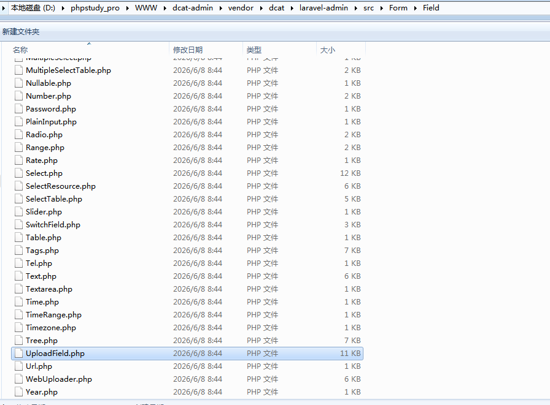

\<?php

namespace Dcat\\Admin\\Form\\Field;

use Dcat\\Admin\\Traits\\HasUploadedFile;

use Illuminate\\Support\\Arr;

use Illuminate\\Support\\Facades\\Storage;

use Illuminate\\Support\\Facades\\URL;

use Illuminate\\Support\\Facades\\Validator;

use Symfony\\Component\\HttpFoundation\\File\\UploadedFile;

use Symfony\\Component\\HttpFoundation\\Response;

trait UploadField

{

use HasUploadedFile {

disk as \_disk;

}

/\*\*

\* Upload directory.

\*

\* \@var string

\*/

protected \$directory = \'\';

/\*\*

\* File name.

\*

\* \@var null

\*/

protected \$name = null;

/\*\*

\* Storage instance.

\*

\* \@var \\Illuminate\\Filesystem\\Filesystem

\*/

protected \$storage;

/\*\*

\* If use unique name to store upload file.

\*

\* \@var bool

\*/

protected \$useUniqueName = false;

/\*\*

\* If use sequence name to store upload file.

\*

\* \@var bool

\*/

protected \$useSequenceName = false;

/\*\*

\* Controls the storage permission. Could be \'private\' or \'public\'.

\*

\* \@var string

\*/

protected \$storagePermission;

/\*\*

\* \@var string

\*/

protected \$tempFilePath;

/\*\*

\* Retain file when delete record from DB.

\*

\* \@var bool

\*/

protected \$retainable = false;

/\*\*

\* \@var bool

\*/

protected \$saveFullUrl = false;

/\*\*

\* Initialize the storage instance.

\*

\* \@return void.

\*/

protected function initStorage()

{

\$this-\>disk(config(\'admin.upload.disk\'));

if (! \$this-\>storage) {

\$this-\>storage = false;

}

}

/\*\*

\* If name already exists, rename it.

\*

\* \@param \$file

\*

\* \@return void

\*/

public function renameIfExists(UploadedFile \$file)

{

if
(\$this-\>getStorage()-\>exists(\"{\$this-\>getDirectory()}/\$this-\>name\"))
{

\$this-\>name = \$this-\>generateUniqueName(\$file);

}

}

/\*\*

\* \@return string

\*/

protected function getUploadPath()

{

return \"{\$this-\>getDirectory()}/\$this-\>name\";

}

/\*\*

\* Get store name of upload file.

\*

\* \@param UploadedFile \$file

\*

\* \@return string

\*/

protected function getStoreName(UploadedFile \$file)

{

if (\$this-\>useUniqueName) {

return \$this-\>generateUniqueName(\$file);

}

if (\$this-\>useSequenceName) {

return \$this-\>generateSequenceName(\$file);

}

if (\$this-\>name instanceof \\Closure) {

return \$this-\>name-\>call(\$this, \$file);

}

if (is_string(\$this-\>name)) {

return \$this-\>name;

}

return \$file-\>getClientOriginalName();

}

/\*\*

\* Get directory for store file.

\*

\* \@return mixed\|string

\*/

public function getDirectory()

{

if (\$this-\>directory instanceof \\Closure) {

return call_user_func(\$this-\>directory, \$this-\>form);

}

return \$this-\>directory ?: \$this-\>defaultDirectory();

}

/\*\*

\* Indicates if the underlying field is retainable.

\*

\* \@param bool \$retainable

\*

\* \@return \$this

\*/

public function retainable(bool \$retainable = true)

{

\$this-\>retainable = \$retainable;

return \$this;

}

public function saveFullUrl(bool \$value = true)

{

\$this-\>saveFullUrl = \$value;

return \$this;

}

/\*\*

\* Upload File.

\*

\* \@param UploadedFile \$file

\*

\* \@return Response

\*/

public function upload(UploadedFile \$file)

{

\$request = request();

\$id = \$request-\>get(\'\_id\');

if (! \$id) {

return \$this-\>responseErrorMessage(403, \'Missing id\');

}

if (\$errors = \$this-\>getErrorMessages(\$file)) {

return \$this-\>responseValidationMessage(\$errors);

}

\$this-\>name = \$this-\>getStoreName(\$file);

\$this-\>renameIfExists(\$file);

\$this-\>prepareFile(\$file);

if (! is_null(\$this-\>storagePermission)) {

\$result = \$this-\>getStorage()-\>putFileAs(\$this-\>getDirectory(),
\$file, \$this-\>name, \$this-\>storagePermission);

} else {

\$result = \$this-\>getStorage()-\>putFileAs(\$this-\>getDirectory(),
\$file, \$this-\>name);

}

if (\$result) {

\$path = \$this-\>getUploadPath();

\$url = \$this-\>objectUrl(\$path);

// Upload succeeded

return \$this-\>responseUploaded(\$this-\>saveFullUrl ? \$url : \$path,
\$url);

}

// Upload failed

return
\$this-\>responseErrorMessage(trans(\'admin.uploader.upload_failed\'));

}

/\*\*

\* \@param UploadedFile \$file

\*/

protected function prepareFile(UploadedFile \$file)

{

}

/\*\*

\* Specify the directory and name for upload file.

\*

\* \@param string \$directory

\* \@param null\|string \$name

\*

\* \@return \$this

\*/

public function move(\$directory, \$name = null)

{

\$this-\>dir(\$directory);

\$this-\>name(\$name);

return \$this;

}

/\*\*

\* Specify the directory upload file.

\*

\* \@param string \$dir

\*

\* \@return \$this

\*/

public function dir(\$dir)

{

if (\$dir) {

\$this-\>directory = \$dir;

}

return \$this;

}

/\*\*

\* Set name of store name.

\*

\* \@param string\|callable \$name

\*

\* \@return \$this

\*/

public function name(\$name)

{

if (\$name) {

\$this-\>name = \$name;

}

return \$this;

}

/\*\*

\* Use unique name for store upload file.

\*

\* \@return \$this

\*/

public function uniqueName()

{

\$this-\>useUniqueName = true;

return \$this;

}

/\*\*

\* Use sequence name for store upload file.

\*

\* \@return \$this

\*/

public function sequenceName()

{

\$this-\>useSequenceName = true;

return \$this;

}

/\*\*

\* Generate a unique name for uploaded file.

\*

\* \@param UploadedFile \$file

\*

\* \@return string

\*/

protected function generateUniqueName(UploadedFile \$file)

{

return md5(uniqid()).\'.\'.\$file-\>getClientOriginalExtension();

}

/\*\*

\* Generate a sequence name for uploaded file.

\*

\* \@param UploadedFile \$file

\*

\* \@return string

\*/

protected function generateSequenceName(UploadedFile \$file)

{

\$index = 1;

\$extension = \$file-\>getClientOriginalExtension();

\$originalName = \$file-\>getClientOriginalName();

\$newName = \$originalName.\'\_\'.\$index.\'.\'.\$extension;

while
(\$this-\>getStorage()-\>exists(\"{\$this-\>getDirectory()}/\$newName\"))
{

\$index++;

\$newName = \$originalName.\'\_\'.\$index.\'.\'.\$extension;

}

return \$newName;

}

/\*\*

\* \@param UploadedFile \$file

\*

\* \@return bool\|\\Illuminate\\Support\\MessageBag

\*/

protected function getErrorMessages(UploadedFile \$file)

{

\$rules = \$attributes = \[\];

if (! \$fieldRules = \$this-\>getRules()) {

return false;

}

\$rules\[\$this-\>column\] = \$fieldRules;

\$attributes\[\$this-\>column\] = \$this-\>label;

/\* \@var \\Illuminate\\Validation\\Validator \$validator \*/

\$validator = Validator::make(\[\$this-\>column =\> \$file\], \$rules,
\$this-\>validationMessages, \$attributes);

if (! \$validator-\>passes()) {

\$errors = \$validator-\>errors()-\>getMessages()\[\$this-\>column\];

return implode(\'; \', \$errors);

}

}

/\*\*

\* Destroy original files.

\*

\* \@return void.

\*/

public function destroy()

{

\$this-\>deleteFile(\$this-\>original);

}

/\*\*

\* Destroy original files.

\*

\* \@param \$file

\*/

public function destroyIfChanged(\$file)

{

if (! \$file \|\| ! \$this-\>original) {

return \$this-\>destroy();

}

\$file = array_filter((array) \$file);

\$original = (array) \$this-\>original;

\$this-\>deleteFile(Arr::except(array_combine(\$original, \$original),
\$file));

}

/\*\*

\* Destroy files.

\*

\* \@param string\|array \$path

\*/

public function deleteFile(\$paths)

{

if (! \$paths \|\| \$this-\>retainable) {

return;

}

\$storage = \$this-\>getStorage();

foreach ((array) \$paths as \$path) {

if (\$storage-\>exists(\$path)) {

\$storage-\>delete(\$path);

} else {

\$prefix = \$storage-\>url(\'\');

\$path = str_replace(\$prefix, \'\', \$path);

if (\$storage-\>exists(\$path)) {

\$storage-\>delete(\$path);

}

}

}

}

/\*\*

\* Get storage instance.

\*

\* \@return \\Illuminate\\Filesystem\\Filesystem\|null

\*/

public function getStorage()

{

if (\$this-\>storage === null) {

\$this-\>initStorage();

}

return \$this-\>storage;

}

/\*\*

\* Set disk for storage.

\*

\* \@param string \$disk Disks defined in \`config/filesystems.php\`.

\*

\* \@throws \\Exception

\*

\* \@return \$this

\*/

public function disk(\$disk)

{

try {

\$this-\>storage = Storage::disk(\$disk);

} catch (\\Exception \$exception) {

if (! array_key_exists(\$disk, config(\'filesystems.disks\'))) {

admin_error(

\'Config error.\',

\"Disk \[\$disk\] not configured, please add a disk config in
\`config/filesystems.php\`.\"

);

return \$this;

}

throw \$exception;

}

return \$this;

}

/\*\*

\* Get file visit url.

\*

\* \@param string \$path

\*

\* \@return string

\*/

public function objectUrl(\$path)

{

if (URL::isValidUrl(\$path)) {

return \$path;

}

return \$this-\>getStorage()-\>url(\$path);

}

/\*\*

\* \@param \$permission

\*

\* \@return \$this

\*/

public function storagePermission(\$permission)

{

\$this-\>storagePermission = \$permission;

return \$this;

}

}

After analyzing all the above code, we found that no file extension
whitelist or blacklist is defined here, and all validation rules are
inherited from UploadField. The getValidator() method only checks file
quantity and required fields, with no verification for file types or
extensions. Files with any extensions such as .php, .pht and .phar
submitted from the frontend will not be blocked.Next, we will conduct an
in-depth analysis of UploadField.php step by step.

Validation Logic Flaw, Validation Entry:upload() -\> getErrorMessages()

if (! \$fieldRules = \$this-\>getRules()) {

return false;

}

\$rules\[\$this-\>column\] = \$fieldRules;

\$validator = Validator::make(\[\$this-\>column =\> \$file\], \$rules
\...);

Validation fully relies on manually configured rules in forms by
developers.There is no default validation for file extensions, MIME
types or file signatures.If no rules are defined, the backend will allow
files with any extensions, including .php, .pht, .php5 and .phar.

Filename Handling Vulnerability (Original filenames are retained by
default). Logic of getStoreName():

// Both useUniqueName and useSequenceName are set to false by default

return \$file-\>getClientOriginalName();

The original filename submitted by the client is used directly by
default.There is no filtering for ../ directory traversal characters.

Attackers can construct filenames like ../../public/shell.php to write
files across directories into the web root.

No file content or file signature verification is implemented. The
prepareFile() is an empty method:protected function
prepareFile(UploadedFile \$file){}

It does not check the actual file content or file headers, so image
webshells and disguised script files can be uploaded directly.

The storage directory is accessible via web by default. It reads the
path from config(\'admin.upload.directory.file\'). Dcat Admin uses
public/uploads as the default directory, which is a public web folder.
Uploaded scripts can be executed simply by accessing their URLs.

Full Exploit Chain of the Vulnerability

Route entry: HandleFormController\@uploadFile

0x1.Enter UploadField::upload()

0x2.If no custom upload validation rules are configured in the form,
getErrorMessages() returns false directly and all checks are bypassed

0x3.The original filename is retained, allowing directory traversal

0x4.The file is written to web-accessible directories such as
public/uploads

0x5.Access the file URL -\> PHP code is parsed and executed -\> Getshell

4.  Vulnerability Fix and Hardening Solutions (Sorted by Priority)

Solution 1: Mandatory Code-level Validation (Recommended)

Modify UploadField.php and add file extension whitelist and MIME type
validation in the getErrorMessages method, or rewrite the upload logic:

Disable original filenames and use random filenames exclusively

Implement a file extension whitelist

Filter directory traversal characters ../

Example of Hardened Code (Append Validation):

protected function getErrorMessages(UploadedFile \$file)

{

// Added: Extension whitelist

\$allowExt =
\[\'jpg\',\'jpeg\',\'png\',\'gif\',\'zip\',\'rar\',\'doc\',\'xls\'\];

\$ext = strtolower(\$file-\>getClientOriginalExtension());

if (!in_array(\$ext, \$allowExt)) {

return \"Disallowed file type for upload\";

}

// Added: Filter directory traversal

\$clientName = \$file-\>getClientOriginalName();

if (str_contains(\$clientName, \'../\') \|\| str_contains(\$clientName,
\'\\\\\')) {

return \"Invalid file name\";

}

// Original validation logic remains unchanged

\$rules = \$attributes = \[\];

if (! \$fieldRules = \$this-\>getRules()) {

return false;

}

\$rules\[\$this-\>column\] = \$fieldRules;

\$attributes\[\$this-\>column\] = \$this-\>label;

\$validator = Validator::make(\[\$this-\>column =\> \$file\], \$rules,
\$this-\>validationMessages, \$attributes);

if (! \$validator-\>passes()) {

\$errors = \$validator-\>errors()-\>getMessages()\[\$this-\>column\];

return implode(\'; \', \$errors);

}

return false;

}

Solution 2: Enforce Validation Rules on Business Forms (No framework
source code modification required)

All file upload forms, manually specify upload rules (whitelist):

\$form-\>file(\'file\')-\>rules(\'file\|mimes:jpg,png,gif,jpeg\|max:2048\');

Solution 3: Server-level Protection (Emergency Mitigation)

Disable PHP script parsing for the uploads directory on Nginx/Apache

Block parsing of alternative extensions including .pht, .php5 and .phar

Restrict execution permissions for the upload directory

Nginx Rule Examples:

location \~\* \^/uploads/.\*\\.(php\|pht\|php5\|phar) {

deny all;

}

Solution 4: Framework Configuration Hardening

Enable uniqueName() to generate random filenames, which prevents
directory traversal and retention of malicious filenames:

\$form-\>file(\'file\')-\>uniqueName();

Edit config/admin.php to move the upload directory out of the public
folder, so that the upload directory cannot be accessed via web
requests.
