Stored Cross-Site Scripting (XSS) Vulnerability in dcat-admin (v1.7.8)

Discoverer: Terry Tian

Credits: Westsec Security Team

1.  Introduction to Vulnerable Project and Affected Version

    Project Overview

    Open-source Project: jqhph/dcat-admin

Project Repository:

<https://github.com/jqhph/dcat-admin>

https://gitee.com/jqhph/dcat-admin

Official Demo/Blog URL: http://www.dcatadmin.com

Project Description: \"A background system building tool based on
Laravel, which can quickly build a fully functional and high-quality
background system with minimal code, equipped with abundant built-in
common components\"

Project Popularity: 4K GitHub Stars, 773 Forks

Affected Version

Version Number: v1.7.8 (Vulnerable stable release)

Release Page: <https://github.com/jqhph/dcat-admin/releases/tag/1.7.8>

The details of affected versions and vulnerable interfaces are as
follows:

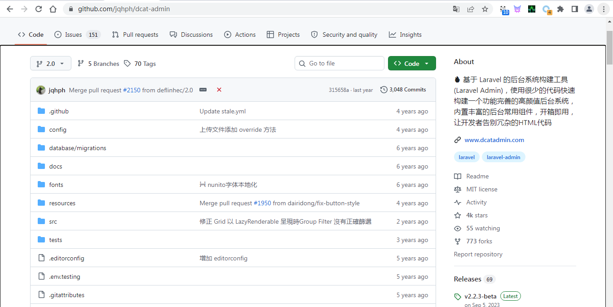

http://192.168.1.3/admin/auth/login，The username and password are both
admin.

Vulnerable Version: Powered by Dcat Admin·v1.7.8

After logging into the system successfully, you can see the version
number of the vulnerable system at the bottom of the page, as shown in
the figure:

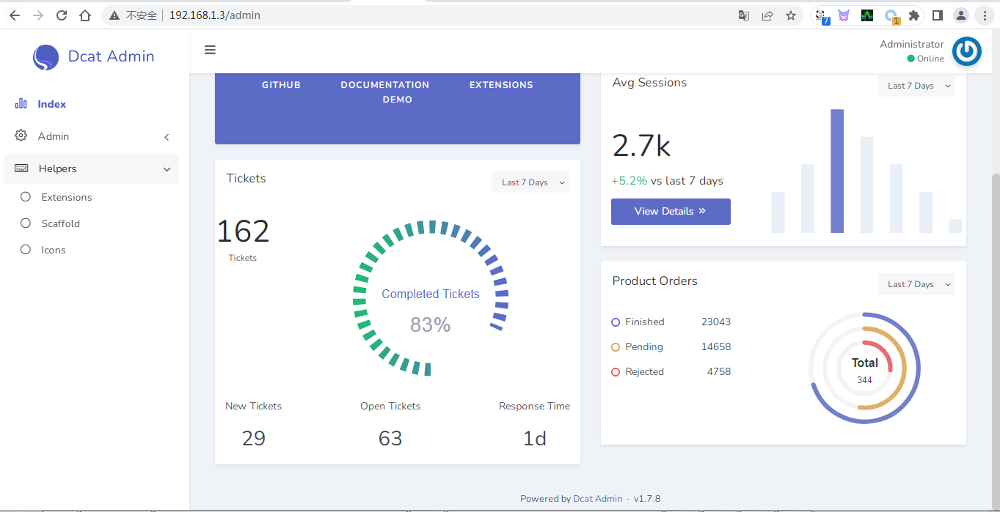

The vulnerable interfaces are listed below:

<http://192.168.1.3/admin/auth/users>

<http://192.168.1.3/admin/auth/setting>

2.  Exploit Ideas and Procedures

    0x1. The attacker logs into the Dcat Admin backend and navigates to
    the personal center or user management page.

    0x2. The system adopts a filename suffix blacklist mechanism. Create
    SVG script files and other malicious files with valid image headers,
    and set the Content-Type to image/png.

    0x3. Upload the crafted files via the avatar upload function which
    depends on the UploadField trait. The backend only validates the
    MIME type and fails to block executable file extensions. The files
    are successfully saved to the directory:
    D:\\phpstudy_pro\\WWW\\dcat-admin\\storage\\app\\public\\images.

    0x4. By default, Laravel and Dcat only allow public access to the
    public directory. To access files stored in the storage directory
    and its subdirectories under the project root, operation and
    maintenance personnel or administrators need to create a symbolic
    link.

    0x5. The attacker visits the uploaded SVG script file via a web
    browser, which results in arbitrary JavaScript code execution.

    Rules of the system\'s suffix blacklist check are as follows:

    Vulnerable Interface 1: <http://192.168.1.3/admin/auth/users>

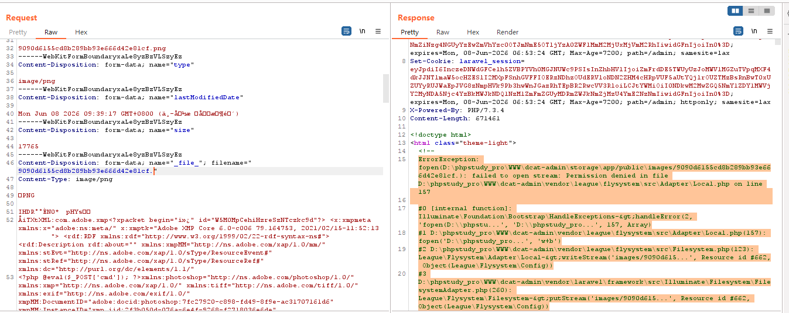

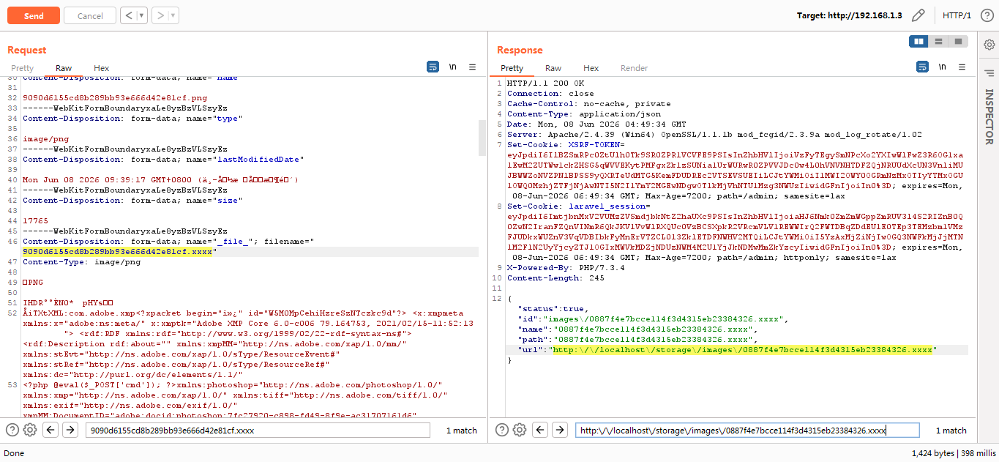

Vulnerable Interface 2：<http://192.168.1.3/admin/auth/setting>

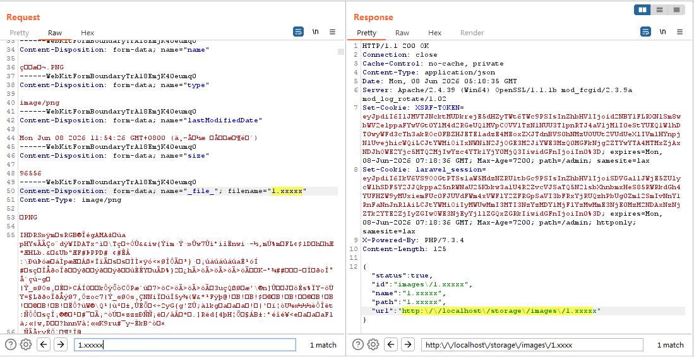

Proof of Concept Procedures are as follows:

Vulnerable Interface 1：<http://192.168.1.3/admin/auth/users>

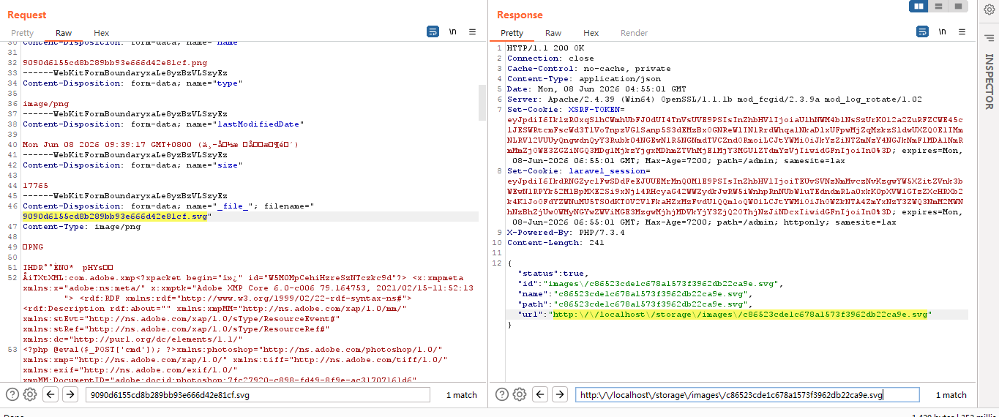

<http://localhost/storage/images/c86523cde1c678a1573f3962db22ca9e.svg>

Payload：\<svg xmlns=\"http://www.w3.org/2000/svg\"
onload=\"alert(1)\"\>\</svg\>

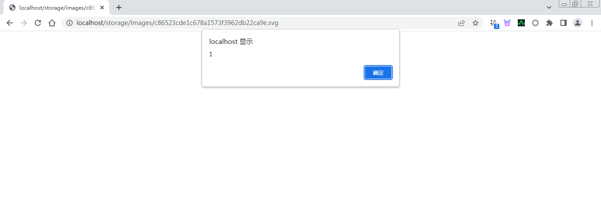

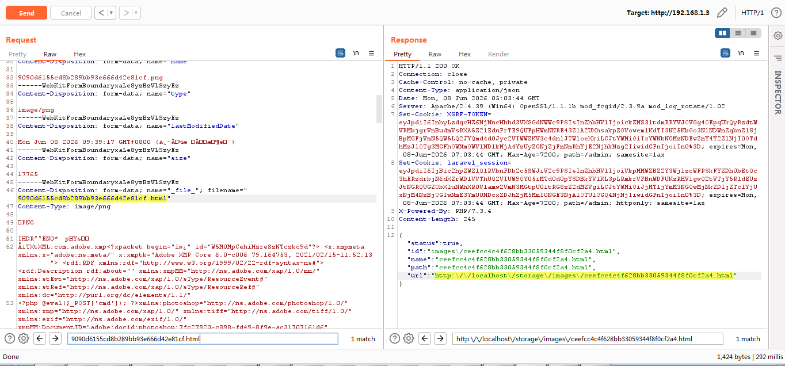

<http://localhost/storage/images/ceefcc4c4f628bb33059344f8f0cf2a4.html>

Vulnerable Interface 2：<http://192.168.1.3/admin/auth/setting>

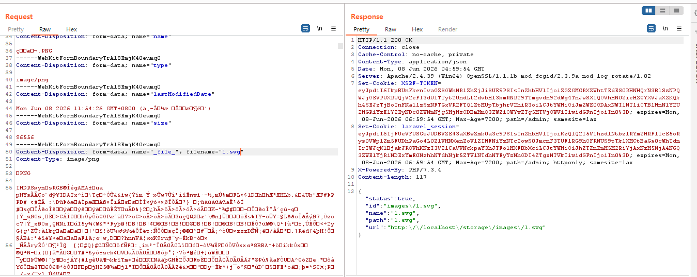

<http://localhost/storage/images/1.svg>

Payload：\<svg xmlns=\"http://www.w3.org/2000/svg\"
onload=\"alert(1)\"\>\</svg\>

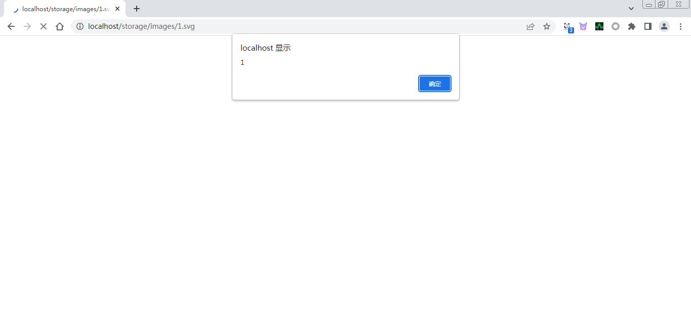

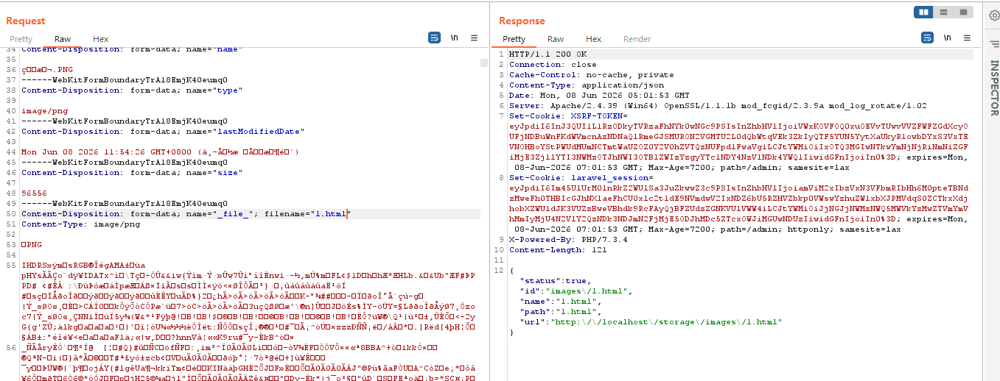

[http://localhost/storage/images/1.html](http://localhost/storage/images/ceefcc4c4f628bb33059344f8f0cf2a4.html)

Summary: The uploadable file types include SVG, HTML and other formats,
as shown in the figure.

Storage
Directory:D:\\phpstudy_pro\\WWW\\dcat-admin\\storage\\app\\public\\images

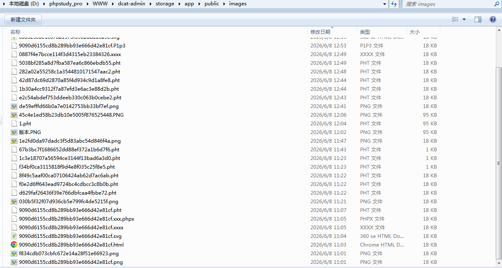

Next, navigate to the project root directory (not the public folder; the
path is D:\\phpstudy_pro\\WWW\\dcat-admin). Run the command php artisan
storage:link to create a symbolic link named public/storage. After that,
the uploaded files can be accessed directly via a web browser. This
configuration is adopted by nearly all websites for business
requirements, as shown in the figure.

Next, access the SVG script file via a web browser to trigger JavaScript
code execution, as shown in the figure.

3.Code Audit Analysis

Next, we analyze the root cause of the vulnerability through the source
code. In fact, the root cause of the file upload vulnerability lies in
the UploadField.php trait. Below, I provide a complete code-level
analysis.

The UploadField trait is the core implementation for all file upload
fields in Dcat Admin (including avatars and attachments). Its validation
logic contains fatal flaws, leading to an arbitrary file upload
vulnerability.

1\. Lack of Core Validation: File Suffix/Type Blacklist Only Defined
Frontend, No Unified Backend Filtering

\$this-\>getRules() retrieves validation rules defined by specific field
classes (e.g., Image/File), not unified validation within the
UploadField trait.

For image fields such as avatars, the rules are typically image or
mimes:jpeg,png. However, these rules rely on Laravel\'s Validator, which
only verifies the file MIME type and does not check the actual file
content or suffix.

Attackers can upload files with an image/png MIME type but with .pht or
.svg suffixes to directly bypass the image rule.

The UploadField itself has no blacklist filtering for executable
suffixes such as .pht, .svg, .html, nor any global suffix validation
logic.

2\. Filename Generation Logic Directly Uses Client-Submitted Suffix
Without Rewriting

\$file-\>getClientOriginalExtension() directly obtains the file suffix
submitted by the client.

The backend does not rewrite the suffix with a whitelist (e.g., force it
to .png), allowing attackers to retain executable suffixes such as .svg
and .html.

For example: even if uploading shell.png.svg, the backend will preserve
the full suffix and write the file without any secure modification.

3\. Upload Storage Logic Has No Filtering and Writes Directly to
Accessible Directory

putFileAs writes the file directly to the directory returned by
\$this-\>getDirectory() without any secondary inspection of the file
content.

The directory path is defined by the field class; avatar files are
written to storage/app/public/images by default. This directory becomes
publicly accessible via the web after creating a symbolic link with php
artisan storage:link.

Uploaded SVG script files will be parsed and executed by Apache,
directly triggering arbitrary code execution.

4\. No File Content Validation, Supports Image Header + Script Mixed
Files

UploadField only relies on Laravel\'s validator image rule, which only
checks the file MIME type and basic image structure without deep content
parsing.

Attackers can upload mixed files with a valid PNG header and malicious
scripts (e.g., PNG + \<svg onload=alert(1)\>).

The backend will recognize it as a valid image and write it to the
server.

Apache will parse the file by its suffix and execute the JavaScript
code, bypassing all validation.

D:\\phpstudy_pro\\WWW\\dcat-admin\\vendor\\dcat\\laravel-admin\\src\\Traits\\HasUploadedFile.php

D:\\phpstudy_pro\\WWW\\dcat-admin\\vendor\\dcat\\laravel-admin\\src\\Form\\Field\\UploadField.php

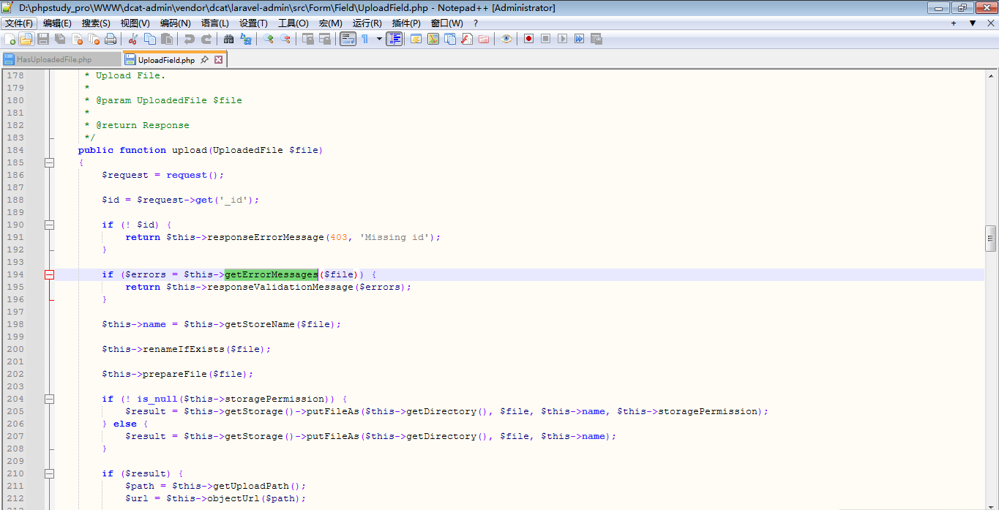

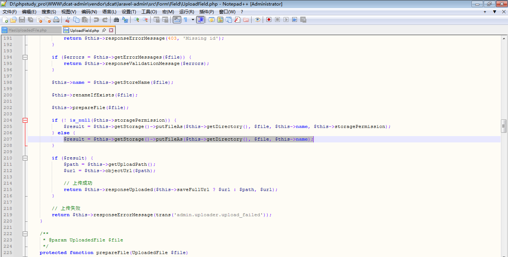